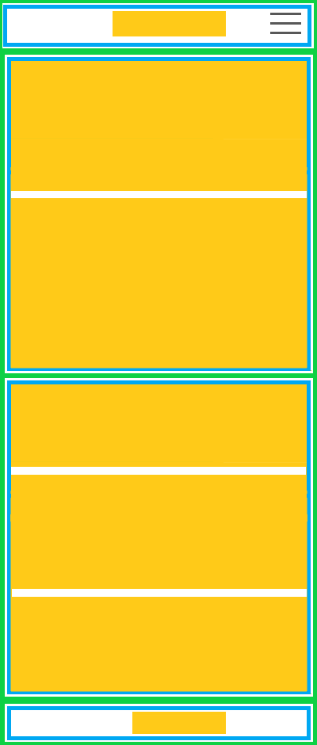
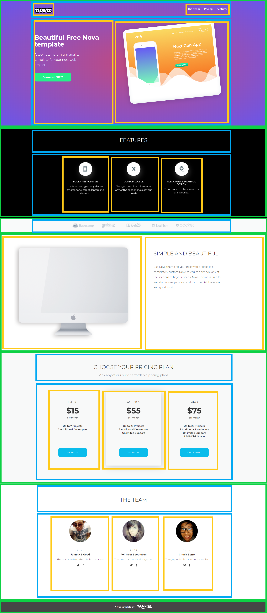

# Ćwiczenie #05

> :loudspeaker: Jeśli chciałbyś więcej tego typu zadań to zapraszam do :moneybag: [wsparcia mojego konta](https://github.com/sponsors/devmentor-pl)!

&nbsp;

<<<<<<< HEAD
Najwyższy czas zakodować prawdziwą stronę internetową! 

Będziemy się wzorować na projekcie od chłopaków z [Webscope](https://webscopeapp.com/), który wygląda tak:

&nbsp;

## Opis projektu

Wszystkie niezbędne grafiki masz przygotowane w katalogu `images`. Znajdziesz tam m. in. [pliki SVG](https://pl.wikipedia.org/wiki/Scalable_Vector_Graphics). Ich podgląd w VS Code możesz wykonać dzięki rozszerzeniu [SVG Viewer](https://marketplace.visualstudio.com/items?itemName=cssho.vscode-svgviewer).

Font, który jest używany w projekcie to [Montserrat](https://fonts.google.com/specimen/Montserrat).

Tło które widać w górnej części strony to gradient: 
`background: radial-gradient(rgb(194, 74, 126), rgb(105, 86, 235));`

Proponuję dla wygody użyć rozszerzenie do Chrome o nazwie [PerfectPixel](https://chrome.google.com/webstore/detail/perfectpixel-by-welldonec/dkaagdgjmgdmbnecmcefdhjekcoceebi), który pozwoli Ci osadzić plik poglądowy, przedstawiony wyżej (lokalizacja: `./assets/demo.png`) jako tło dla renderowanej strony, co uławi Ci kodowanie.

Projekt nie musi być wykonany zgodnie z pierowzrorem 1:1. Ważne, aby na pierwszy rzut oka było widać, że jest to dokładne odwzorowanie.

## Propozycja podziału

Poniżej zamieszczam propozycję podziału strony na poszczególne grupy, gdzie:

- wiersz (`width: 100%`), kolor zielony
- wyśrodkowanie (`max-width: 1050px`), kolor niebieski niebieski
- komórka (wiele elementów w jednej linii), pomarańczowy

Nie musisz się od nich stosować to jedynie moja koncepcja, która ma Ci pomóc utworzyć odpowiednią strukturę.
=======
Najwyższy czas zakodować układ strony, który będzie posiadał widok *mobilny* oraz *desktopowy*. 
Oczywiście całość kodujemy z duchem *mobile first*, a punktem granicznym (ang. *breakpoint*) będzie 800px. 

&nbsp;

&nbsp;

Podobnie jak w zadaniu z *HTML i CSS: Podstawy*, poszczególne elementy oznaczają:

* **zielone krawędzie** to obszar dostępny dla przeglądarki, czyli element o 100% szerokości, która wyznacza nasze sekcje
* **niebieskie krawędzie** to maksymalna szerokość naszej strony - powiedzmy, że wynosi 1000px
* **pomarańczowe prostokąty** to dowolna zawartość

Zwróć uwagę, że w przypadku widoku mobilnego, krawędzie niebieskie i zielone praktycznie nachodzą na siebie. Można by było je pominąć. Jednak mając na uwadze widok desktopowy możemy je od razu dodać do struktury HTML.

## Mobile

### Sekcja nr 1

Posiada menu, które jest wyśrodkowane w poziomie. Z prawej strony jest tzw. hamburger - po jego kliknięciu powinna pojawić się zawartość dla menu. Całość możemy uznać za nagłówek.

### Sekcja nr 2

Zawiera dwa elementy, wyświetlane jeden pod drugiem z niewielkim odstępem między nimi.

### Sekcja nr 3

Podobnie jak w sekcji poprzedniej tylko tym razem mamy trzy, a nie dwa elementy.

### Sekcja nr 4

Stopka naszej strony, która zwiera jedynie element wyśrodkowany w pionie i poziomie.

## Desktop

Układ identyczny jak w przypadku [zadania 5 z *HTML i CSS: Podstawy*](https://github.com/devmentor-pl/practice-html-and-css-basics/tree/master/05). Jednak wykonaj to zadania od początku mając na uwadze układ mobilny.

# Zadanie dodatkowe

Teraz możesz spróbować przebudować układ z [*HTML i CSS: podstawy*](https://github.com/devmentor-pl/practice-html-and-css-basics/tree/master/05). Zrób to w taki sposób, aby dodać do wszcześniej utworzonego widoku, widok mobilny. Sam ocenisz, który sposób tj. *mobile first* czy *desktop first* jest wygodniejszy.

>>>>>>> 578c8b4f027bcc9e10d2c98c66acf951de608287

&nbsp;

> :warning: Jeśli nie posiadasz materiałów do tego zadania to znajdziesz je na stronie [devmentor.pl](https://devmentor.pl/p/html-and-css-basics/)
